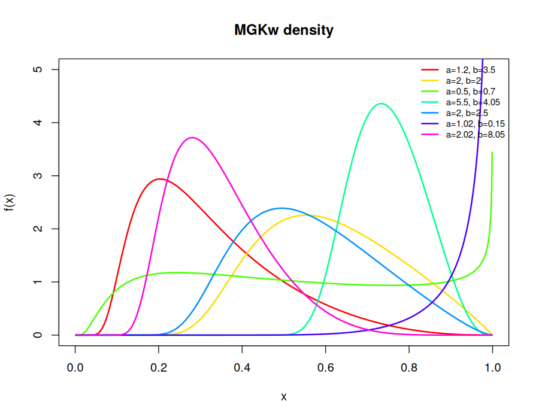

# MG-Kumaraswamy (MGKw) Distribution

R implementation of the **MG-Kumaraswamy distribution**, a two-parameter
generalization of the Kumaraswamy distribution obtained by applying the MG
transmutation map to the Kumaraswamy baseline. The transformation adds
**no extra parameters**, which avoids the reparameterization problem common to
other generalized families.

This code accompanies my undergraduate thesis in Statistics at the Federal
University of Technology, Owerri (supervisor: Dr. Kizito E. Anyiam) and the
manuscript that grew out of it:

> Anyiam, K. E., Daniels, E. M., Iwu, H. C., & Nwafor, G. O. *MG Kumaraswamy
> Distribution for Enhanced Data Modeling and Application.* Manuscript under
> review.

## The distribution

For shape parameters `a, b > 0` and support `x` in `(0, 1)`:

**CDF**

$$F(x) = \exp\left(-\frac{(1-x^a)^b}{1-(1-x^a)^b}\right)$$

**PDF**

$$f(x) = \frac{ab\,x^{a-1}(1-x^a)^{b-1}}{\left[1-(1-x^a)^b\right]^2}\exp\left(-\frac{(1-x^a)^b}{1-(1-x^a)^b}\right)$$

**Quantile function**

$$Q(u) = \left[1-\left(\frac{\ln u}{\ln u - 1}\right)^{1/b}\right]^{1/a}$$

The density takes unimodal, left- and right-skewed, J, reverse-J, monotone
decreasing and bathtub shapes. The hazard function takes bathtub,
increasing–decreasing–increasing, and increasing forms — flexibility that is
unusual for a two-parameter model on the unit interval.



## Repository layout

```
R/
  mgkw-distribution.R       density, CDF, quantile, RNG, hazard, survival,
                            moments, log-likelihood, MLE fitting
  competing-distributions.R Kumaraswamy, Inverted Kumaraswamy (IKw),
                            Generalized IKw, Marshall–Olkin Extended IKw
  01-plots.R                density, CDF, survival and hazard shape plots
  02-simulation.R           Monte Carlo study of the MLEs (Table 2)
  03-application.R          fits to two real datasets vs competing models
output/                     generated tables (CSV)
figures/                    generated plots (PNG)
```

## Usage

```r
source("R/mgkw-distribution.R")

dmgkw(0.5, a = 1.2, b = 3.5)      # density
pmgkw(0.5, a = 1.2, b = 3.5)      # distribution function
qmgkw(0.5, a = 1.2, b = 3.5)      # quantile
x <- rmgkw(500, a = 1.2, b = 3.5) # random sample

fit <- fit_mgkw(x)                 # maximum likelihood (BFGS)
fit$par                            # estimated (a, b)
sqrt(diag(solve(fit$hessian)))     # standard errors
```

Reproduce everything from the repository root:

```r
source("R/01-plots.R")
source("R/02-simulation.R")     # 10,000 replications; about 4 minutes
source("R/03-application.R")
```

Only base R (`stats`, `graphics`, `grDevices`) is required. Tested with R 4.3.3.

## Reproducing the manuscript

Running the scripts reproduces the manuscript's results as follows.

| Result | Manuscript | This code |
|---|---|---|
| MGKw MLE, COVID-19 France (Table 5) | a = 1.3488 (0.1323), b = 16.5923 (5.3099) | a = 1.3488 (0.1323), b = 16.5924 (5.3100) |
| MGKw AIC, COVID-19 France | −141.290 | −141.290 |
| MGKw CVM / AD / KS, France (Table 6) | 0.0584 / 0.4686 / 0.0981 | 0.0584 / 0.4686 / 0.0981 |
| MGKw MLE, P3 algorithm (Table 9) | a = 0.2949, b = 0.9572 | a = 0.2950, b = 0.9572 |
| MGKw AIC, P3 algorithm | −13.0359 | −13.0359 |
| Simulation averages, n = 1000 (Table 2) | a = 1.0030, b = 0.7713 | a = 1.0043, b = 0.7721 |

The log-likelihoods and AIC values of the IKw, MOEIKw and Kw fits also
reproduce for both datasets. The manuscript is being revised, and this
repository will be updated to match the final published version.

Implementation notes:

- The goodness-of-fit statistics are the Chen & Balakrishnan (1995) modified
  Cramér–von Mises (W\*) and Anderson–Darling (A\*) statistics.
- The three-parameter competitor likelihoods have local optima, so every
  competing model is fitted from a grid of starting values and the best
  solution is kept.
- Corrections relative to my original working scripts:

  - `set.seed()` was called **inside** the replication loop, which
    regenerates an identical sample every replication and collapses the
    Monte Carlo variance to zero. The seed is now set once, before the loop.
  - An earlier draft of the quantile function placed the exponent `1/a` on
    the inner bracket rather than the outer one. `F(Q(u)) = u` now holds to
    machine precision for all `a`, `b`.

## Data

- **COVID-19 mortality rate, France**, 1 January – 20 February 2021 (n = 51)
- **Unit capacity factors estimated by the P3 algorithm** (n = 22), from
  Caramanis, Stremel, Fleck & Daniel (1983), *Probabilistic production
  costing: an investigation of alternative algorithms*, International
  Journal of Electrical Power & Energy Systems, 5(2), 75–86

Both are included directly in `03-application.R`.

## Related work

Anyiam, K. E., Ezerioha, E. I., Ogbonna, J. C., & Daniels, M. E. (2024).
New Generalized Nadarajah Haghighi Distribution: Characterization and
Applications. *Journal of Modern Applied Statistical Methods*, 23(1).
https://doi.org/10.56801/Jmasm.V23.i1.11

## Author

**Daniels Ebuka Marvelous** — B.Tech. Statistics, Federal University of
Technology, Owerri.

## License

MIT — see `LICENSE`.
